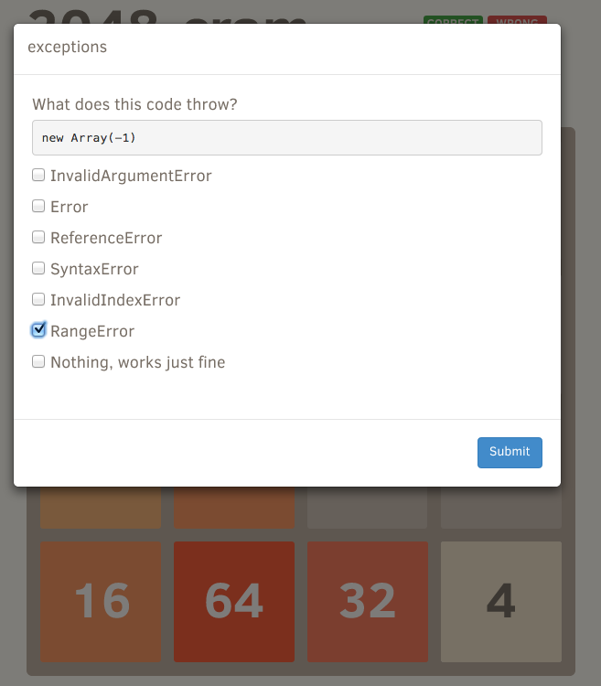

# 2048-cram

[Play 2048-cram](http://glebbahmutov.com/2048-cram/)

It is a clone of [2048 5x5](https://github.com/bahmutov/2048)
with an occasional popup question to let you cram JavaScript topics.
If you answer the question correctly - the pieces move, otherwise
they stay put, plus new tiles appear. Basically you lose a turn AND
get a penalty tile by answering incorrectly.

The questions can have zero, one, several or all correct answers.

You can learn answers by reading these books:

* [JavaScript Patterns](http://www.amazon.com/JavaScript-Patterns-Stoyan-Stefanov/dp/0596806752) by Stoyan Stefanov
* [Effective JavaScript](http://www.amazon.com/gp/product/B00AC1RP14) by David Herman
* [JavaScript Enlightenment](http://www.amazon.com/gp/product/B00ARPT74S) by Cody Lindley
* [Secrets of the JavaScript Ninja](http://www.amazon.com/Secrets-JavaScript-Ninja-John-Resig/dp/193398869X) by John Resig
* [Speaking JavaScript](http://www.amazon.com/Speaking-JavaScript-Axel-Rauschmayer-ebook/dp/B00INES03O) by Alex Rauschmayer

and a few [other books](http://bahmutov.calepin.co/javascript-books.html)

If you would like to discuss a question, please [open an issue](https://github.com/bahmutov/2048-cram/issues) on Github

## Small print

Author: Gleb Bahmutov &copy; 2014

* [@bahmutov](https://twitter.com/bahmutov)
* [glebbahmutov.com](http://glebbahmutov.com)
* [blog](http://bahmutov.calepin.co/)

License: MIT - do anything with the code, but don't blame me if it does not work.

Spread the word: tweet, star on github, etc.

Support: if you find any problems with this module, email / tweet /
[open issue](https://github.com/bahmutov/2048-cram/issues) on Github
